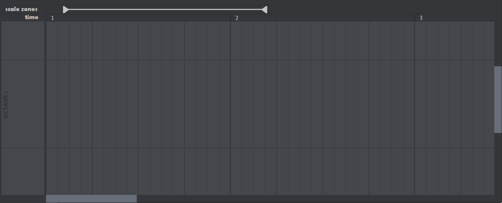
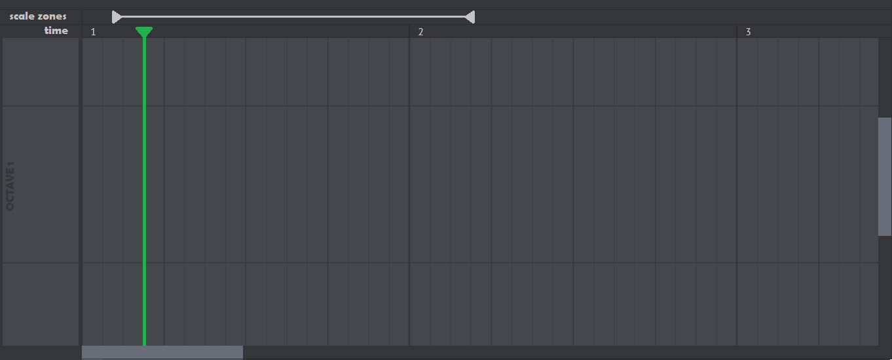
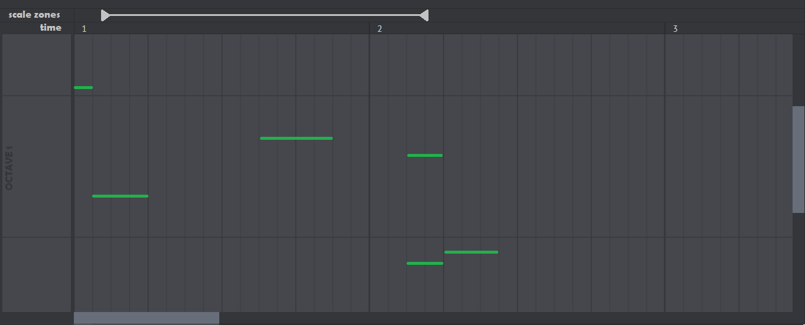
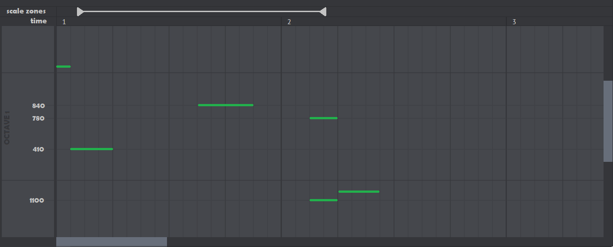
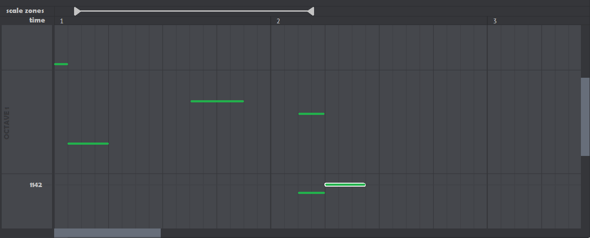

# Blank Sequencer

* There is time and scale zones on top. Scale zones contain notes over a certain period of time.
* On the left you will find information about the pitches of the notes, also the octave number is also displayed there.

# Playing

Music plays when the green slider moves.

# Notes

Click on canvas to create a note. It automatically becomes selected, see `Selecting Notes` section

# Show cents

You can enable the mode when cents of notes in the current scale zone are shown.

# Selecting Notes

You can select one or more notes. For selected notes the cents display mode will be automatically enabled.

* If you have selected one note, you can delete it, shift it up or down by a certain number of cents, shift it by an interval, set the number of cents, shift it by time, and change the duration.
* If you have selected several notes, you can delete them, or shift them in time, or by a certain number of cents, or by an interval.

# Creating notes based on existing ones

When you enable the mode for creating notes based on existing ones, lines appear along the notes from the scale zone (as in the note cents display mode), as well as all their transpositions up and down octaves.  
In this mode, notes can only be placed on these lines.  

# Creating new notes

This mode is similar to the previous one, but instead of using notes from the scale zone, the lines go through new potential notes (and their octave transpositions). These new potential notes are found using a special algorithm, see `./Research/General_algorithm.ipynb`.

# Potential notes stability analysis

While you are in the modes described in the sections `Creating notes based on existing ones` or `Creating new notes`, you can turn on the mode of evaluating the stability of potential notes. Then you need to select the start time of the potential note and its duration. After that, the algorithm described in `./Research/General_algorithm.ipynb` will graphically show the stability of all potential notes.